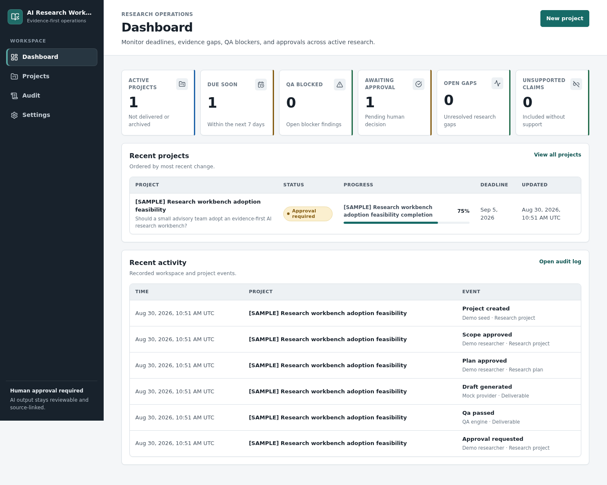
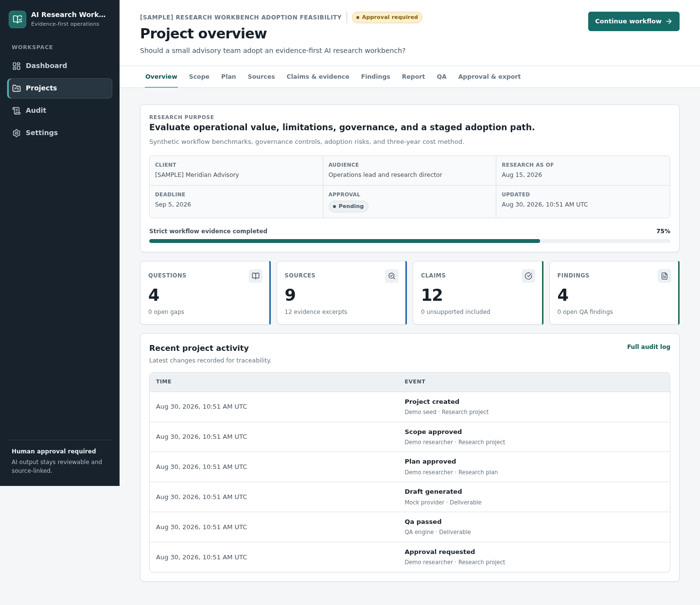

# AI Research Workbench

AI Research Workbench is a local, evidence-first workspace for turning a research brief into a reviewable report. It keeps the source-to-evidence-to-claim chain visible, runs strict QA before approval, records human decisions, and produces delivery artifacts without requiring an AI or search API key.

This repository is an implementation-oriented MVP, not a hosted research marketplace or an autonomous fact-finding agent. The current runtime assumes one trusted local user and local PostgreSQL. It does **not** provide production authentication or authorization.

## Problem and workflow

Research teams often lose the reasoning between a source and the sentence that appears in a report. This workbench models that reasoning explicitly:

1. Capture and approve a scoped brief.
2. Decompose it into questions and approve a research plan.
3. Register sources, extract verified evidence, and link evidence to claims.
4. Turn claims into findings and an eleven-section report.
5. Run fourteen deterministic QA rules.
6. Resolve every blocker, request review, and record explicit human approval.
7. Export Markdown, HTML, PDF, DOCX, CSV, or an approval-gated ZIP bundle.

Progress is calculated from eight equal workflow gates rather than from a manually entered percentage. See [Research workflow](docs/RESEARCH_WORKFLOW.md) and [QA rules](docs/QA_RULES.md).

## Screenshots

The screenshot script captures the seeded dashboard and project overview at a fixed desktop viewport:





Run `npm run screenshots` while the seeded application is running. Screenshots are evidence of that fixture state, not proof that all verification commands passed.

## What is implemented

- Next.js 16, React 19, and strict TypeScript application foundations.
- PostgreSQL 17 with a raw SQL migration runner and a normalized research graph.
- Route handlers for projects, scope, questions, plans, sources, evidence, claims, findings, reports, QA, approval, audit events, and exports.
- A source → evidence → claim → finding → report model with freshness, duplicate, support, conflict, gap, citation, and revision metadata.
- Fourteen pure TypeScript QA rules with strict blocker semantics: an accepted-risk blocker still blocks approval until it is resolved.
- Deterministic mock AI and search providers selected by default.
- Optional OpenAI Responses adapter with strict JSON Schema output and optional Brave Search adapter.
- Manual, search, safe-URL-fetch, multipart-upload, JSON/Markdown import, and cross-project source-reuse paths.
- URL-fetch and upload security controls, including SSRF/DNS-rebinding defenses, redirect revalidation, byte/time limits, filename normalization, content checks, private file storage, and HTML sanitization.
- Explicit approval and delivery transitions with audit events.
- Markdown, HTML, PDF, DOCX, CSV, and ZIP generation; persisted artifacts include a SHA-256 digest and byte size.
- An API-key-free synthetic sample project with intentionally stale, duplicate, unsupported, and conflicting evidence cases.

Browser pages cover the dashboard, project list/create/overview, scope, plan, sources/detail, claim/evidence ledger, findings, report/revisions, QA, approval/export, audit, and read-only provider settings. The source page exposes every acquisition path. The plan action invokes the configured provider (deterministic mock by default) for question decomposition and research-plan suggestions, persists run provenance, and still requires human approval. A typed pipeline API can also invoke and persist any one stage explicitly. See [Current limits](#current-limits).

## Local setup

Prerequisites:

- Node.js 22 or newer
- npm
- Docker with Compose, or a separately managed PostgreSQL instance

```bash
cp .env.example .env
npm ci
npm run db:start
npm run db:migrate
npm run seed
npm run dev
```

Open `http://localhost:3100`. The local database is exposed on port `55432` by the supplied Compose file.

Useful commands:

```bash
npm run doctor
npm run db:stop
npm run export-demo
```

`ALLOW_DATABASE_RESET=true npm run db:reset` truncates the configured database's application tables. Use it only for an explicitly disposable local database after checking `DATABASE_URL`. Tests use `TEST_DATABASE_URL`, and the preparation script refuses a database name that does not contain `test`.

## Demo

Demo mode is on by default. `npm run seed` creates `project-demo`, a clearly marked synthetic project with nine sources, twelve evidence records, twelve claims, four findings, one accepted research gap, one known duplicate, one intentionally outdated source, a reconciled conflict, report revisions, historical QA findings, and audit events. Fixture URLs and quantitative statements are examples, not real market evidence.

The normal demo path is:

```bash
npm run setup
npm run dev
```

Then inspect the sample project, trace a report citation back to evidence, run QA, review the approval state, and generate non-final exports. `npm run export-demo -- --approve` mutates the demo approval state before creating the final ZIP; use it only when that explicit demo transition is intended. See [Demo guide](docs/DEMO.md).

## Environment

| Variable | Required | Default/example | Purpose |
| --- | --- | --- | --- |
| `DATABASE_URL` | Yes | local `research_workbench` database | Application, migration, seed, and export connection |
| `TEST_DATABASE_URL` | For DB tests | local `research_workbench_test` database | Isolated disposable test database |
| `DEMO_MODE` | No | `true` | Keeps deterministic mock AI/search active |
| `OPENAI_API_KEY` | Live AI only | empty | Enables the OpenAI adapter when demo mode is off |
| `OPENAI_MODEL` | No | `gpt-5-mini` | Responses API model name |
| `BRAVE_SEARCH_API_KEY` | Live search only | empty | Enables the Brave Search adapter when demo mode is off |
| `APP_URL` | No | `http://localhost:3100` | Displayed application origin and screenshot/browser-test base URL |
| `PDF_FONT_PATH` | No | platform fallback | Explicit font file for required PDF language coverage |
| `MAX_UPLOAD_BYTES` | No | `5242880` | File-validation ceiling |
| `MAX_FETCH_BYTES` | No | `2097152` | Remote-response ceiling |
| `FETCH_TIMEOUT_MS` | No | `10000` | Remote-fetch timeout |
| `STORAGE_DIR` | No | `./.data` | Private upload and generated-artifact storage |

Do not commit `.env`, provider keys, customer research, fetched private content, or generated delivery bundles.

## Tests and verification

The repository defines unit, database-backed, browser, static-analysis, and build commands. This table intentionally records what to run, not a claim that a command passed in a particular checkout.

| Evidence needed | Command to run | Handoff record |
| --- | --- | --- |
| Environment and service diagnostics | `npm run doctor` | Record output during final verification |
| Unit behavior | `npm run test:unit` | Record test count and result |
| Database-backed suite | `npm test` | Requires PostgreSQL and `TEST_DATABASE_URL`; record result |
| Integration lane | `npm run test:integration` | Exercises PostgreSQL workflow, QA, approval, deletion, and artifact behavior |
| Browser lane | `npm run test:e2e` | Starts the configured app and exercises desktop plus mobile Chromium workflows |
| Type safety | `npm run typecheck` | Record result |
| Lint | `npm run lint` | Record result |
| Production bundle | `npm run build` | Record result |
| Full configured gate | `npm run verify` | Record result; this does not include Playwright |
| Export inspection | `npm run export-demo` | Open the generated PDF/DOCX/HTML and inspect archive contents |

The GitHub Actions workflow additionally starts PostgreSQL, migrates and seeds it, runs static and automated checks, builds, installs Chromium, and runs the Playwright specs. A declared command is still not completion evidence unless its actual result is recorded.

## Security boundary

Remote content is untrusted data. The URL-fetch utility permits only HTTP(S), rejects credentials and local/reserved destinations, validates every DNS result, pins validated addresses, revalidates redirects, bounds response size and time, and allowlists response media types. The file validator supports CSV, DOCX, HTML, JSON, Markdown, PDF, and plain text with extension/MIME/signature/size checks. External HTML is sanitized and prompt-injection-like text is flagged.

Those controls do not make this production-ready. There is no production login, role model, CSRF strategy, malware scanner, multi-process rate limiter, secret manager, tenant isolation, or deployment-managed TLS. The current in-memory rate limiter is per process. Fetch/upload routes are active in the local app, so do not expose them to untrusted users. Review [Security](docs/SECURITY.md) before connecting this application to real data or the public internet.

## Current limits

- Single trusted local user; actor labels such as “Local user” are audit labels, not identities.
- Local PostgreSQL is the supported development data store; backup and retention operations are not automated.
- Playwright specs cover the main desktop workflow and a mobile project surface, and a browser-backed screenshot script captures the sample. They are a regression baseline, not exhaustive accessibility or cross-browser certification.
- Plan generation applies provider-backed question and plan suggestions, and the pipeline API can run and persist any typed stage, but the application does not automatically orchestrate all eleven stages into accepted records. Live OpenAI/Brave calls have not been exercised without provider keys.
- Safe URL fetch, search, upload, JSON/Markdown import, manual entry, and source reuse are implemented. Search-result registration does not fetch/verify page bodies automatically; use the safe-fetch path separately.
- The upload path recognizes and privately stores CSV, DOCX, HTML, JSON, Markdown, PDF, and TXT. PDF/DOCX text extraction is not implemented, and no upload is malware-scanned.
- A database `jobs` table exists, but there is no worker or retry scheduler.
- PostgreSQL integration tests parse generated PDF, DOCX, and ZIP structures and verify workflow bypass attempts. Visual fidelity, target-office compatibility, and language-specific PDF font coverage still require inspection in the target environment.
- No email, webhook, hosted storage, collaborative editing, or automatic delivery is implemented.

## Documentation

- [Product](docs/PRODUCT.md)
- [Architecture](docs/ARCHITECTURE.md)
- [Data model](docs/DATA_MODEL.md)
- [Research workflow](docs/RESEARCH_WORKFLOW.md)
- [AI pipeline](docs/AI_PIPELINE.md)
- [QA rules](docs/QA_RULES.md)
- [Security](docs/SECURITY.md)
- [Export formats](docs/EXPORT_FORMATS.md)
- [Deployment](docs/DEPLOYMENT.md)
- [Demo](docs/DEMO.md)
- [Roadmap](docs/ROADMAP.md)

## Conceptual influences and reuse

The interaction and operational model was informed conceptually by these local projects:

- `web/web-template/templates/internal-tool-base`: internal-tool composition and explicit backend/auth/persistence boundaries.
- `web/google-docs-clone/Front-End`: a persistent document-workspace shell, review state, and safe document conversion boundaries.
- `automation-projects/ai-chatbot-rag`: bounded citations, provenance, sanitized fixtures, and untrusted retrieved content.
- `automation-projects/internal-tools-dashboard`: allowlisted view models, dense operational status, detail views, and explicit action boundaries.
- `automation-projects/mvp-build-service`: bounded intake, staged completion, acceptance evidence, and reviewable handoff artifacts.

No source code or assets were copied from those projects. Their repository roots do not provide a top-level license granting reuse, so they were treated only as conceptual references. AI Research Workbench itself is distributed under the repository's [MIT license](LICENSE).

## Provider references

- [OpenAI Responses API — create a model response](https://developers.openai.com/api/reference/cli/resources/responses/methods/create)
- [Brave Search API — web search endpoint](https://api-dashboard.search.brave.com/api-reference/web/search/get)
- [Brave Search API quickstart](https://api-dashboard.search.brave.com/documentation/quickstart)
